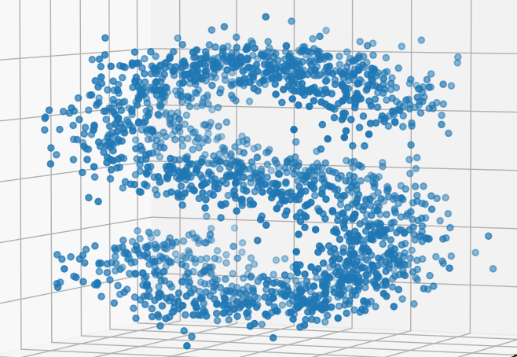
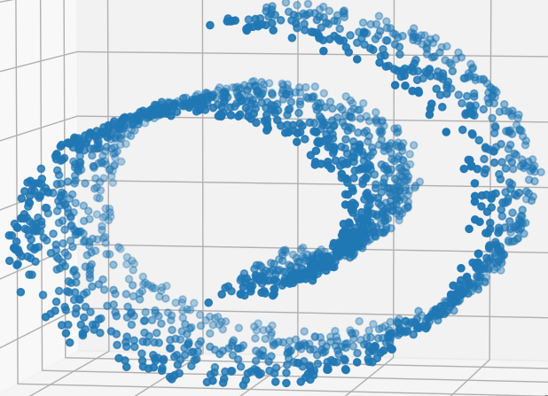

<table align="center">
    <thead>
        <tr>
            <th>Generator</th>
            <th>Preview</th>
        </tr>
    </thead>
    <tbody align="center" valign="center">
        <tr>
            <td >make_s_curve</td>
            <td></td>
        </tr>
        <tr>
            <td >make_swiss_roll</td>
            <td></td>
        </tr>
    </tbody>
</table>
